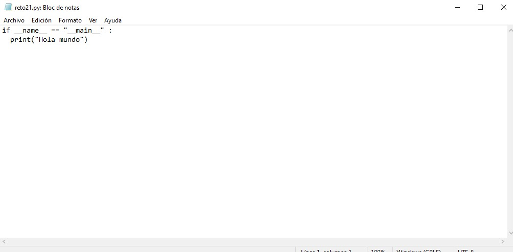
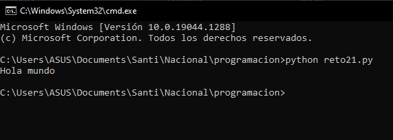
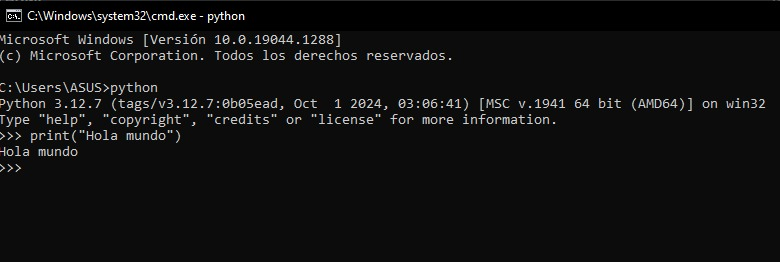
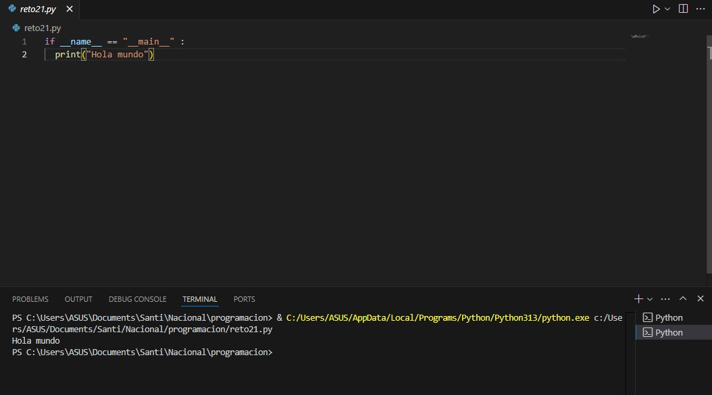

# Reto-2-Programaci-n-UNAL
Presento mi repositorio desarrollado con sus 3 puntos
- "Hola mundo" en el block de notas 
- "Hola mundo" en el intérprete de Phyton 
- "Hola mundo" en VS Code

## "Hola mundo" en el block de notas 

Abierto y ejecutado con CMD

## "Hola mundo" en el intérprete de Phyton 

## "Hola mundo" en VS Code

